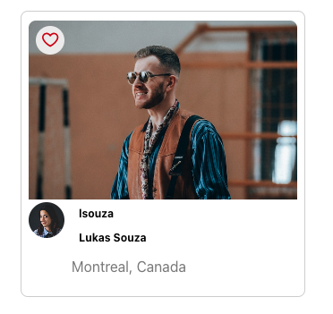
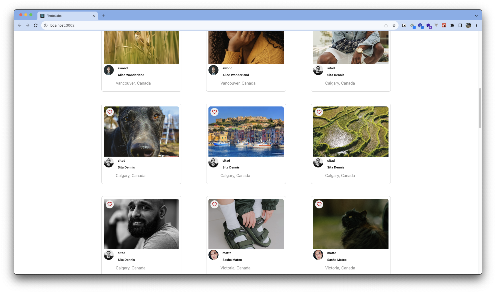
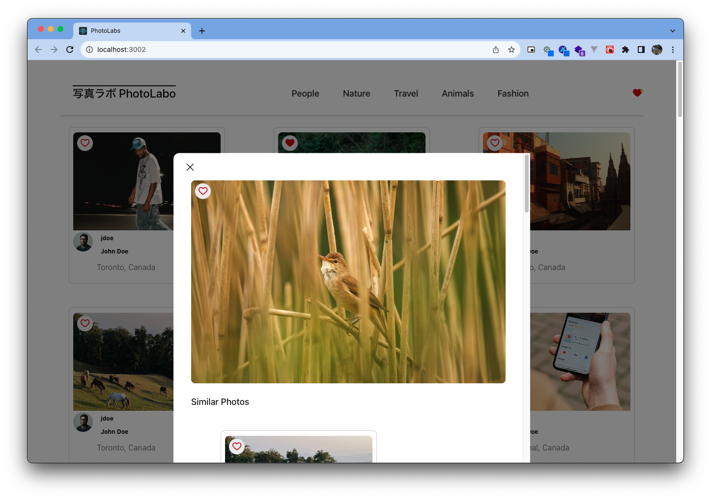
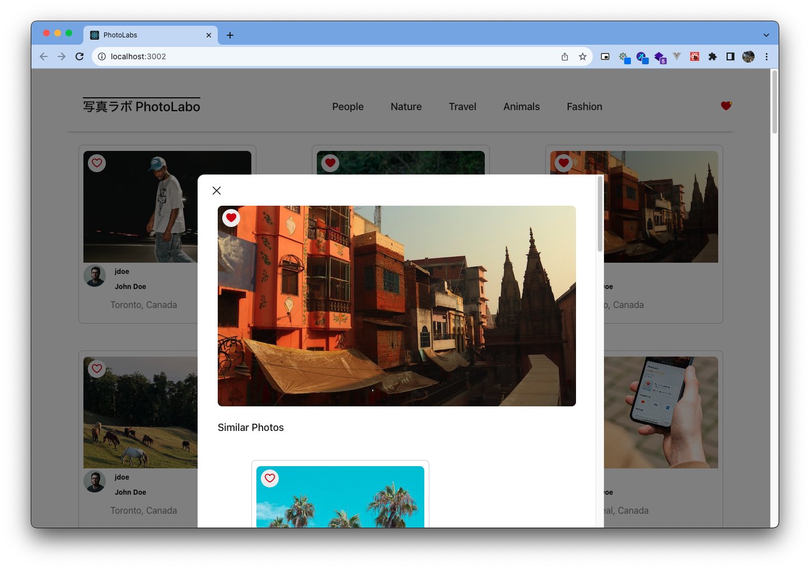
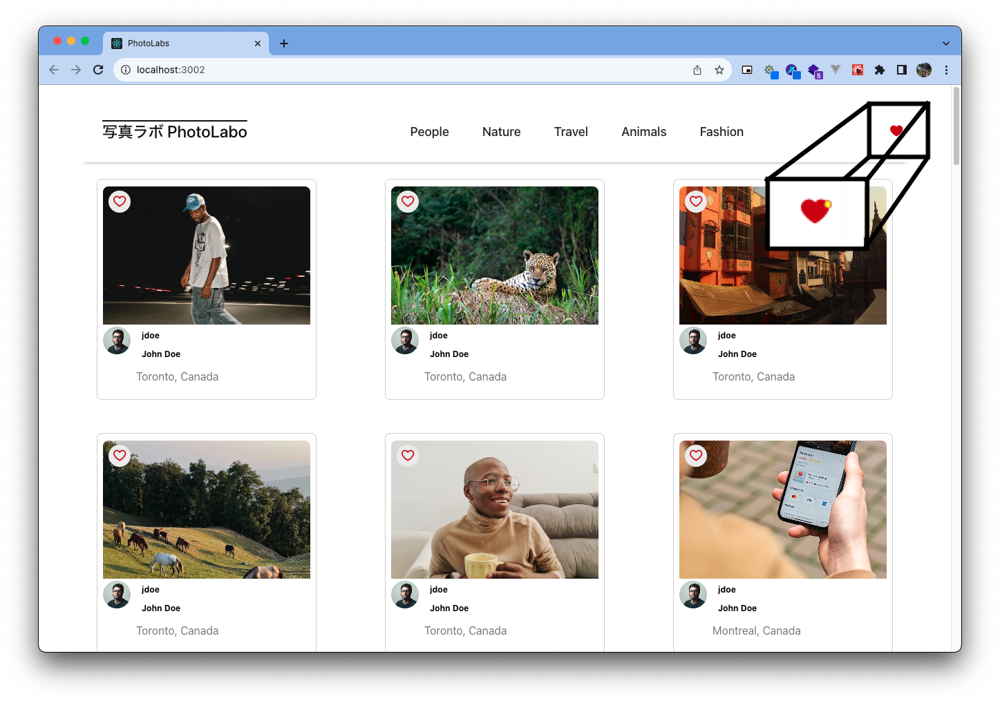
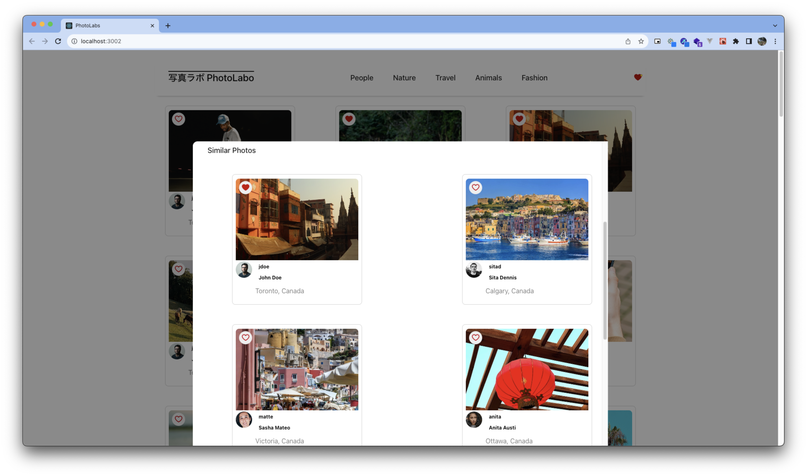

# react-photolabs

The PhotoLabs project for the Web Development React course programming.

# Photolabs

Welcome to PhotoLabs, an opporunity to find your new favourite photos!
Photolabs has many great features to enhance your enjoyment of the photos.

<p align="center">

### Individual Photographer profiles



### A collaborative space to share photos



### Modular Views of Photos




### The ability to mark your favourite photos



### Similar photos linked together!



</p>

## Setup

Install dependencies with `npm install` in each respective `/frontend` and `/backend`.

</p>

## [Frontend] Running Webpack Development Server

```sh
cd frontend
npm start
```

## [Backend] Running Backend Servier

Read `backend/readme` for further setup details.

```sh
cd backend
npm start
```
